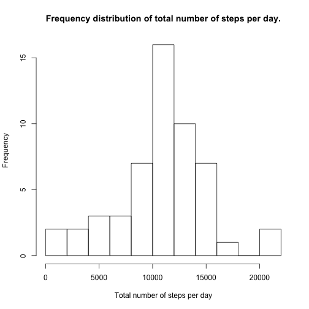
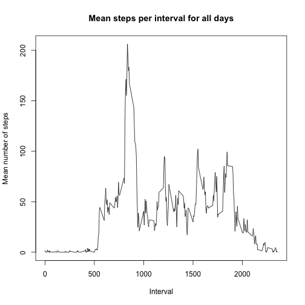
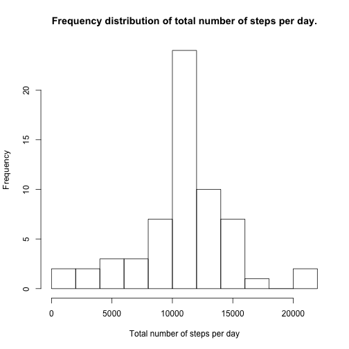
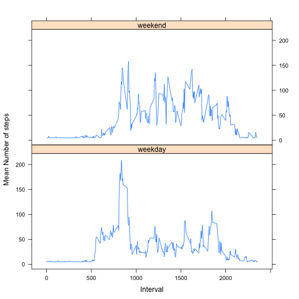

Load the data
=============


```r
setAs("character","myDate", function(from) as.Date(from, format="%Y-%m-%d") )
d = read.csv("activity.csv",colClasses=c('numeric', 'myDate','numeric'))
d = mutate(d,interval_factor=as.factor(sprintf("%04d",d$interval)))
```


What is mean total number of steps taken per day?
=================================================


```r
by.date = group_by(d,date)
d1 = summarize(by.date,total_count=sum(steps))
hist(d1$total_count,breaks=10,xlab = "Total number of steps per day",main="Frequency distribution of total number of steps per day.")
```

 

```r
mean(d1$total_count,na.rm = TRUE)
```

```
## [1] 10766.19
```

```r
median(d1$total_count,na.rm = TRUE)
```

```
## [1] 10765
```

What is the average daily activity pattern?
===========================================


```r
by.interval = group_by(d,interval)
d2 = summarise(by.interval, mean_over_days_for_interval=mean(steps,na.rm=TRUE))
plot(d2$interval,d2$mean_over_days_for_interval,type='l',main="Mean steps per interval for all days",xlab="Interval",ylab="Mean number of steps")
```

 

Which interval has the max average over all the days?


```r
max_index = which(d2$mean_over_days_for_interval == max(d2$mean_over_days_for_interval))

d2[max_index,]
```

```
## Source: local data frame [1 x 2]
## 
##   interval mean_over_days_for_interval
## 1      835                    206.1698
```

Imputing Missing Values
=======================

Number of rows with missing values


```r
length(which(complete.cases(d) == FALSE))
```

```
## [1] 2304
```

Lets fill in those NAs with a value that is the mean of daily interval means.


```r
daily_mean = summarise(by.date,daily_mean=mean(steps,na.rm=TRUE))
replacement_value = mean(daily_mean$daily_mean,na.rm=TRUE)
new_d = d
new_d[is.na(d)] <- replacement_value

by.date_new_d = group_by(new_d,date)
d1_new = summarize(by.date_new_d,total_count=sum(steps))
hist(d1_new$total_count,breaks=10,main="Frequency distribution of total number of steps per day.",xlab = "Total number of steps per day")
```

 

```r
mean(d1_new$total_count,na.rm = TRUE)
```

```
## [1] 10766.19
```

```r
median(d1_new$total_count,na.rm = TRUE)
```

```
## [1] 10766.19
```

Are there differences in activity patterns between weekdays and weekends?
=========================================================================


```r
new_d = mutate(new_d,day_of_week = weekdays(new_d$date,abbreviate = TRUE))
new_d = mutate(new_d,day_type = ifelse(new_d$day_of_week %in% c("Sat","Sun"),"weekend","weekday"))
new_d = mutate(new_d,day_type=as.factor(day_type))
new_d = mutate(new_d,interval_number=as.numeric(new_d$interval))

by.date_type.interval = group_by(new_d,interval,day_type)
d3 = summarize(by.date_type.interval,d_mean=mean(steps))
xyplot(d_mean ~ interval|day_type, 
           data = d3,
           type = "l",
           xlab = "Interval",
           ylab = "Mean Number of steps",
           layout=c(1,2))
```

 
